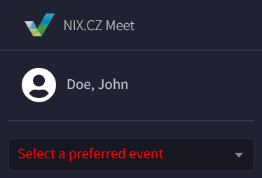

[Rejstřík](../README.md) | [Zpět](0005.md) | [Další](0007.md)

# Základní rozvržení a funkce modulů
Po rozkliknutí konkrétního modulu z hlavního menu se vždy zobrazí 📄 **výpis záznamů** *(kromě modulu [Dashboard](0002.md))*.

Aplikace umožňuje provozovat více Eventů najednou, data v modulech jsou vázané ke konkrétnímu Eventu *(preferred event)*. Tedy je potřeba jej mít v hlavním menu vždy vybraný. 

> [!NOTE]
>Pokud preferred event není zvolen, tak se u některých modulů nemusí vůbec zobrazit data a bude zde o této skutečnosti zobrazeno žluté upozornění.
>
>

 

## 📄 Výpis záznamů

**(1) 📦 Název modulu**

**(2) Drobečková navigace**

**(3) Tlačítko pro založení nového záznamu**

**(4) 🔍 Filtrování** výpisu záznamů a **vyhledávací pole**. 
Filtrování má většinou každý modul jiné.

**(5a) 💡  Hromadné akce + počet vybraných záznamů** na které se akce provede. Každý modul má vlastní hromadné akce, které lze s vybranými záznamy provést. Jedinou společnou akcí, kterou je možné využít ve většině modulů je mazání záznamů.

*Ukázka hromadných akcí u uživatelů:*

**(5b) Výběr všech** zobrazených záznamů pro hromadnou akci.
> [!IMPORTANT]  
> Při zaškrtnutí tohoto checkboxu v záhlaví výpisu jsou vybrány jen záznamy nacházející se na aktuální stránce *(stránkování je po 100 záznamech)*. 
Pokud by jste chtěli akci provést na úplně všechny záznamy je kromě zaškrtnutí tohoto checkboxu potřeba ještě navíc kliknout na odkaz **Select all Users**

**(5c) Výběr konkrétního záznamu** pro hromadnou akci

(6) **Výpis dostupných záznamů** po aplikování filtru a stránkování

(7) **Celkový počet záznamů** s možností nechat zobrazit všechny na jednu stránku.
> [!IMPORTANT]  
>POZOR: v případě velkého počtu záznamů tato operace může zabrat hodně času a výpočetního výkonu.

(8) **Stránkování** se zobrazí pouze v případě, že je uloženo více jak 100 záznamů

## Řazení výpisu dle sloupců

Sloupce v hlavičce výpisové tabulky, které jsou modrou barvou je možné kliknutím seřadit:
- Sestupně  
- Vzestupně   

Řazení je možné zrušit kliknutím na ikonu křížku   

> [!NOTE]
> Výpis je možné řadit i dle více sloupců najednou

 

---
 

> [!IMPORTANT]  
> Kliknutím na hodnotu v prvním sloupci výpisu přejdete do editačního formuláře.

 

## ✏️ Editační Formulář

## **(1) 🔖 Karty** *(Taby)*
Pro případy modulů, kdy je editační formulář rozsáhlejší, je pro zpřehlednění rozdělen na části mezi kterými se můžete přepínat.

## **(2) Formulář** *(na kartě General)*
Formulář se základními informacemi o uživateli

Formulářová pole pro zadání datumů umožňují kromě ručního zadání ve formátu: YYYY-MM-DD HH:II:SS vložit datum pomocí výběru z kalendáře. 

Položky formuláře, které obsahují vazbu na záznam z jiného modulu mají u sebe další 4 ikony pro zrychlenou manipulaci s nimi v nově otevřeném popup okně.

 - Editace navázaného záznamu

 - Založení zcela nového navázaného záznamu

 - Smazání navázaného záznamu

 - Náhled navázaného záznamu

 

## **(3) 💎 Funkční tlačítka** 
Zde se nachází veškeré možnosti, které je se záznamem možné provést. Každý modul může mít různá tlačítka.

Základní tlačítka:

**Save** - Uloží záznam a vrátí se v modulu na výpis všech záznamů

**Delete** - Smaže záznam *(avšak pouze v případě že se nikde nevyskytuje, pokud ano zobrazí se seznam konfliktů, které brání smazání)*

**Save and add another** - Záznam se uloží a po uložení se zobrazí prázdný formulář pro přidání dalšího záznamu.

**Save and continue editing** - Po uložení záznamu se zobrazí detail uloženého záznamu

**History** - seznam změn prohlíženého záznamu

> [!NOTE]
> Na následujících stránkách dokumentace naleznete rozepsané funkce a vlastnosti modulů a také to, čím se liší oproti na této stránce popsaným základům.

  
---
[Rejstřík](../README.md) | [Zpět](0005.md) | [Další](0007.md)