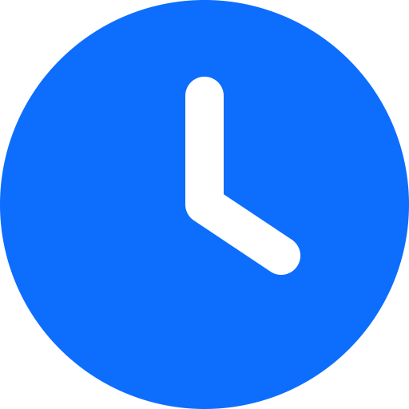

[Index](../README.md) | [Back](0007.md) | [Next](0009.md)

# Meeting Modules
These are core modules of the application, in which all the logic and behavior of arranging meetings, reserving tables, etc. is defined.

 

# 📦 |&nbsp;  Events 🔧

## 📄 List of records
### 🔍 FILTERING IS NOT AVAILABLE IN THIS MODULE

The listing has a slightly different behavior, depending on the Event status.

**Status:**
- **In preparation** - with this status, the Event is not public, it is used for the setup period, to generate tables, time slots, etc.
- **Published** - Once the event switches to this status, everything will be published and users will see the option to register for the Event after logging in
- 🚧 *Ended* - *(Ended event not yet implemented, Event should only be in "readonly" mode, only for archival purposes)*
- **Deleted** - Deleted Event, it physically remains in the database, but is not displayed anywhere.

**Generators**
-  - Time slot generator
    
     Just enter **start and end date / time** + **slot length** in minutes. After saving, the generator automatically creates the necessary number of timeslots between these times.
-  - Location Generator

     **Name:** Table name prefix

     **Start Number in name:** - The number from which the autoincrement of newly generated tables should start. The resulting shape will be, for example: Table 1, Table 2, Table 3, etc.

     **Capacity**: The number of people the location is intended for *(mostly tables for 4 people)*

     **Valid From** and **Valid To**: Location validity. Chairs may not be available for the entire duration of the event, e.g. some areas may only be available on the first day of the event.

## ✏️ Editing Form
- **Name** - Name of the Event, it is used in many places *(Information emails, headlines in the frontend, etc.)*

- **Description** - Short description, a short paragraph about the focus of the Event is most often used here
- **Date start** - Date and time when the Event starts
- **Date end** - Date and time when the Event ends
- **Registration Ends** - The date until which registrations are allowed
- 🚧 *Max Persons - Currently unused*
- 🚧 *Max per Company - Not used at the moment*
- 🚧 *External URL - Not in use at the moment*
- **Timezone** - Time zone of the country in which the Event will take place
- **Status** - *(When setting up, leave "In preparation", as soon as everything is set, it is possible to switch to "Published")*

- **Mail Template From** - "Default template" - creates a default email template for a new event. If you want to use templates from an older event that was created earlier, you can select it and after saving the form, the templates will be copied.

- *👁 Created* - The date the record was created
- *👁 Modified* - The date the record was last edited
- *👁 Slug* - Unique page identifier, used in url addresses

## 💎 Function buttons

**Publish** - This button will only appear for an event that has the status "In preparation". After clicking, the Event will be published *(status will change to "Published")*

   

# 📦 |&nbsp;  Subevents 🔧
Here you can define parts of the Main Event program for which you need to track participation.

This module works very closely with the module *([Subevent Participants](#_3))*

## 📄 List of records
### 🔍 FILTERING IS NOT AVAILABLE IN THIS MODULE

### 💡 BULK ACTIONS:

- **Delete selected Subevents** - deletion of selected records, this action can only be performed if there are no links to these records anywhere, otherwise a page with conflicts will be displayed.

## ✏️ Editing Form
- **Name** - Name of the Subevent whose attendance you want to monitor
- **Description** - A brief note for hostesses, possibly a procedure for checking in. The information will only be displayed to users with "Hostess" permission in the QR code reader.

- **Type**
     - **Check-in** - This type should have only one subevent set. This is the main check-in - entry of the participant to the Event. Participants who have passed the check-in are then displayed in the list of participants in the frontend in green.
     - **Generic** - Common subevent for which you want to track participation *(e.g. paid lecture, lunch, dinner, etc.)*

- **Event** - Selection of the Event to which the location is bound

- **Date start**, **Date end** - Start and end of the subevent

- *👁 Created* - The date the record was created
- *👁 Modified* - The date the record was last edited

   

# 📦 |&nbsp;  Subevent Participants 

The module is designed to monitor participation in parts of the program that are defined in the [Subevents](#_03) module. You can track how many people have already passed or are yet to pass through Check-in. How many people are participating in the subevent. Or easily find out whether a specific person has already arrived or not.

## 📄 List of records

### 🔍 FILTERING
- Status
- Subevent
- Full text search

### 💡 BULK ACTIONS:

- **Delete selected Subevents Participants** - Delete selected records

## ✏️ Editing Form
- **Subevent** - Link to record in the Subevents module
- **User** - Binding to user
- **Status** - Checkin status for the selected subevent
     - **Canceled** - The participant has apologized and will not arrive
     - **Confirmed** - Participant passed through the entrance to the subevent
     - **Pending** - The participant has not yet arrived
- *👁 Created* - The date the record was created
- *👁 Modified* - The date the record was last edited

   

# 📦 |&nbsp;  Registrations 🌎

The module in which all user registrations for Events are stored.

## 📄 List of records

### 🔍 FILTERING
- Status
- Full text search

### 💡 BULK ACTIONS:

- **Delete selected Registrations** - Delete selected registrations

- **Print QR code labels** - Creates an HTML printable page containing the generated qrcodes of selected users' registrations. This functionality is suitable for creating labels on participants' badges and subsequent checking when entering the conference.

- **Mark selected users as confirmed** - Confirms selected registrations *(confirmed users can start planning their meetings in the frontend)*

- **Download list of registrations** - Export of registered participants to a *.csv file

- **Send Event Invitations** - Emails will be sent using the "EVENT_INVITE" template

- **Send Event Reminders** - Emails will be sent using the "EVENT_REMINDER" template

## ✏️ Editing Form
**Event** - Selection of the Event to which the registration is linked

**User** - Selection of the User to whom the registration is linked

**Preferred location** - If the user has chosen a preferred location, it is stored here

🚧 **Metadata** - Special JSON field with additional information *(used at the moment only to store information about which users the calendar is shared with)*

- **Status** - checkin status for the selected subevent
     - **New** - Status of the newly created registration *(Only if it was selected manually when creating the user, the user does not have access anywhere)*
     - **Sent** - Occurs when a new registration is created in the administration, or when a user is imported to the event using the API
     - **Confirmed** - A user who has confirmed his registration
     - 🚧 *Rejected - Not used*
     - **Cancel** - In case the user cancels the participant's registration for the event. Meetings to which he has been invited so far will be set as "Rejected" and those he has scheduled will be cancelled. At the same time, all notifications will be sent to other users.
     - 🚧 *Deleted* - Not in use

## 💎 Function buttons
**Cancel Registration** - Cancels the participant's registration for the Event. Meetings to which he has been invited so far will be set as "Rejected" and those he has planned himself will be cancelled. At the same time, all notifications will be sent to other users.

**Sent Event Invitation** - Sends an email to the user using the "EVENT_INVITE" template

   

# 📦 |&nbsp;  Slots 🔧

A module in which time slots are defined for which it is possible for participants to make appointments

## 📄 List of records

### 🔍 FILTERING IS NOT AVAILABLE IN THIS MODULE

### 💡 BULK ACTIONS:

- **Delete selected Slots** - deletion of selected entries, this action can only be performed if there are no links to these entries anywhere, otherwise a page with conflicts will be displayed.

## Workload

It shows how the total percentage of locations are occupied for a specific time slot.
- **Green** *(0 - 64%)* - There are still plenty of free locations
- **Orange** *(65 - 89%)* - Vacant locations are decreasing, it is to be considered whether to add more tables where participants could meet.
- **Red** *(90 - 100%)* - Locations are almost or completely occupied

As well as a graphic representation of the occupation of the location:
- **Red tile** - The location is occupied
- **Light part** - The location is free.

> **NOTE**
> After hovering the mouse over a specific part, the name of the location will be displayed.

## ✏️ Editing Form
- **Name** - Name of the slot
- **Start**, **End** - Start and end of the time slot

- *👁 Event* - Event to which the record is linked
- *👁 Created* - The date the record was created
- *👁 Modified* - The date the record was last edited

   

# 📦 |&nbsp;  Locations 🔧

A module in which locations and tables are defined where Event participants can hold their meetings.

## 📄 List of records

💎 **Refresh For Meetings** function button - when clicked, the MEET application checks all meetings that do not have a table assigned and tries to assign it automatically.

### 🔍 FILTERING IS NOT AVAILABLE IN THIS MODULE

### 💡 BULK ACTIONS:
- **Delete selected Locations** - deletion of selected records, this action can only be performed if there are no links to these records anywhere, otherwise a page with conflicts will be displayed.

## Workload

> [!NOTE]
> It works the same as [Workload u Slotů](#_1), but in this case it is a reversed view. That is, the recording shows on which days and time slots the location is no longer available.

## ✏️ Editing Form
- **Name** - Location name
- **Description** - Displayed in the frontend
- **Owner** - Some companies may have a reserved or paid location at the Event, here it is possible to assign the location to the company as the owner.
- **Event** - Selection of the Event to which the location is bound
- **Capacity**: The number of people the location is designed for *(mostly tables for 4 people)*

- **Predefined** - In the application, each user can set up their own locations *(for example, they agree to meet completely outside the event building)* in which case the value will be "False". If it is a table pre-generated by the organizer, the value will be "True".

- **Valid From** and **Valid To**: Location validity. Chairs may not be available for the entire duration of the event, e.g. some areas may only be available on the first day of the event.

- *👁 Created* - The date the record was created
- *👁 Modified* - The date the record was last edited

   

# 📦 |&nbsp;  Meetings 🌎

All records of meetings between participants for specific locations and time slots are stored in this module.

## 📄 List of records

### 🔍 FILTERING
- Status

### 💡 BULK ACTIONS:
- **Delete selected Meetings** - deletion of selected records, this action can only be performed if there are no links to these records, otherwise a page with conflicts will be displayed.

## ✏️ Editing Form

### 🔖 GENERAL card

- **Slot** - Selection of the slot when the meeting will take place
- **Location** - The location where the meeting will take place

- **Fixed Location** - When checked *(True)* identifies the location that the initiator of the meeting changed manually *(it is then not affected by automatic location assignment)*

- **Subject** - Subject of the meeting
- **Description** - A more detailed description or program of what will be discussed
- **Initiator** - Who called the meeting
- **Status**
     - **Created** - If a new record is created, or if none of the participants has yet confirmed the meeting
     - **Confirmed** - Participation has been confirmed by all invited participants
     - **Rejected** - All invited participants refused to participate
     - **Canceled** - The initiator canceled the meeting
     - **Partly Confirmed** - Confirmed by at least one participant
     - **Busy** - Identifies the slot in which the user is busy, meetings cannot be scheduled for this date
     - 🚧 *Deleted* - Not in use

- *👁 Event* - Event to which the record is linked

### 🔖 PARTICIPANTS tab
List of all participants who were invited to the meeting and the status of the invitation.

### 🔖 MESSAGES tab
Displays a list of all comments related to the selected meeting.

   

---
[Index](../README.md) | [Back](0007.md) | [Next](0009.md)